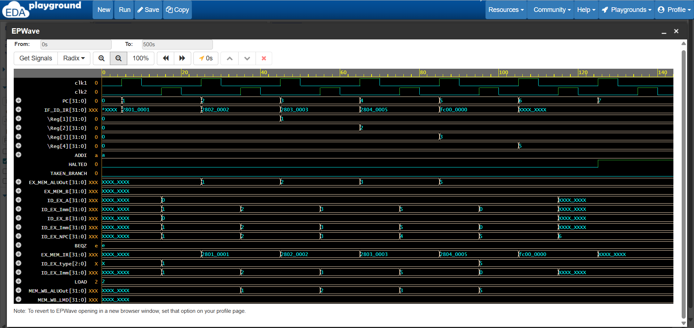

# MIPS32 5-Stage Pipelined Processor

A Verilog implementation of a **5-stage pipelined MIPS32 processor** with the following stages:
- **IF**: Instruction Fetch
- **ID**: Instruction Decode & Register Read
- **EX**: Execute / ALU
- **MEM**: Memory Access
- **WB**: Write Back

---

## Features
- Implements basic arithmetic and immediate instructions: `ADD`, `ADDI`
- Supports memory operations: `LW`, `SW`
- Branch instructions with pipeline control: `BEQZ`, `BNEQZ`
- Halt instruction to stop execution (`HLT`)
- Fully pipelined with IF/ID, ID/EX, EX/MEM, MEM/WB registers

---

## Files
- `pipe_MIPS32.v` – Main structural processor code
- `tb_pipe_MIPS32.sv` – Testbench for simulation
- `instructions.mem` – Sample program memory file
- `waveform.png` – Timing diagram from simulation
- `README.md` – Project documentation

---

## How to Simulate
1. Open the project in **EDA Playground** or any Verilog simulator (e.g., Icarus Verilog).
2. Load `tb_pipe_MIPS32.sv` as the testbench.
3. Ensure `instructions.mem` is in the same folder.
4. Run the simulation to generate `pipe_mips32.vcd`.
5. View `waveform.png` for the timing diagram.

---

## Sample Program (`instructions.mem`)
```
28010001  // ADDI R1, R0, 1
28020002  // ADDI R2, R0, 2
28030003  // ADDI R3, R0, 3
28040005  // ADDI R4, R0, 5
fc000000  // HLT
```

### Expected Output
```
R[1] = 1
R[2] = 2
R[3] = 3
R[4] = 5
```

---

## Timing Diagram
Below is the waveform showing clock signals, PC, pipeline registers, and register values:



---

### Author
Moumita Maji  
B.Tech, NIT Jamshedpur
