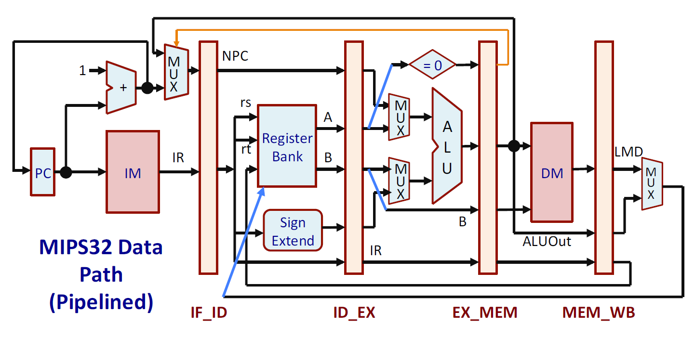

MIPS32 5-Stage Pipelined Processor
Project Overview

This project implements a MIPS32 processor in Verilog using a classic 5-stage pipeline. The design is based on a subset of the MIPS32 instruction set architecture (ISA) and demonstrates how instruction pipelining improves throughput while maintaining correct execution semantics.

The processor supports the following pipeline stages:

Instruction Fetch (IF)

Instruction Decode (ID)

Execution (EX)

Memory Access (MEM)

Write Back (WB)

The project covers datapath design, instruction encoding/decoding, pipeline registers, hazard considerations, and Verilog RTL modeling.

Features

32 general-purpose registers (R0–R31), each 32-bit.

R0 is hardwired to 0 (cannot be modified).

Program Counter (PC) for tracking the next instruction.

Word-addressable memory model (32-bit words).

Subset of MIPS32 ISA implemented:

Arithmetic/logic: ADD, SUB, MUL, AND, OR, SLT

Immediate arithmetic: ADDI, SUBI, SLTI

Memory access: LW, SW

Branches: BEQZ, BNEQZ

Special: HALT

Pipeline registers: IF/ID, ID/EX, EX/MEM, MEM/WB.

Basic hazard handling (stopping writes after HALT or discarding instructions after a branch is taken).

Architecture

The processor is divided into five pipeline stages:

Instruction Fetch (IF)

Fetch instruction from memory using PC.

Increment PC → NPC (Next PC).

Handle branch feedback if a branch is taken in EX stage.

Instruction Decode (ID)

Decode opcode and instruction type (R-type or I-type).

Prefetch source registers (rs, rt).

Perform sign extension for 16-bit immediates.

Execution (EX)

ALU operations: arithmetic or logic.

Address calculation for memory instructions.

Branch target calculation and condition check.

Memory Access (MEM)

LW: Read from data memory.

SW: Write to data memory.

Branch resolution: update PC if branch is taken.

Write Back (WB)

Write ALU result (or memory data) into register file.

Destination register depends on instruction type (rd for R-type, rt for I-type).

Instruction Encoding

MIPS instructions are 32 bits wide. Two primary formats are used in this project:

R-type: opcode (6 bits), rs (5 bits), rt (5 bits), rd (5 bits), unused (11 bits).

I-type: opcode (6 bits), rs (5 bits), rt (5 bits), immediate (16 bits).

Figure 1. MIPS Instruction Encoding Formats

Pipelined Processor Datapath

The datapath is implemented with pipeline registers between each stage.

Figure 2. Block Diagram of the 5-Stage Pipelined Processor

Hazards Considered

Structural hazards are avoided by separating instruction memory and data memory.

Data hazards: not fully resolved in hardware; test programs may require inserting NOPs to avoid incorrect results.

Control hazards: incorrectly fetched instructions are discarded if a branch is taken.

Test Program

The following program was tested to validate correctness of arithmetic, logic, branch, and halt instructions. It was loaded into the instruction memory (instr_mem.mem).

20010005   // addi $1, $0, 5        -> $1 = 5
2002000A   // addi $2, $0, 10       -> $2 = 10
00221820   // add $3, $1, $2        -> $3 = 15
00622022   // sub $4, $3, $2        -> $4 = 5
00222824   // and $5, $1, $2        -> $5 = 0
00223025   // or  $6, $1, $2        -> $6 = 15
10220002   // beq $1, $2, skip      -> not taken
20070064   // addi $7, $0, 100      -> $7 = 100
FC000000   // halt                  -> stop execution

 Results after execution:

$1 = 5

$2 = 10

$3 = 15

$4 = 5

$5 = 0

$6 = 15

$7 = 100 (since the branch was not taken)

Execution stops at the HALT instruction.

References

Indranil Sengupta, Hardware Modeling using Verilog, Lecture 37–40 (Pipeline Implementation of a Processor), IIT Kharagpur.

David A. Patterson, John L. Hennessy, Computer Organization and Design: The Hardware/Software Interface.
